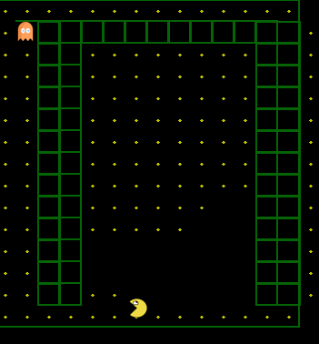
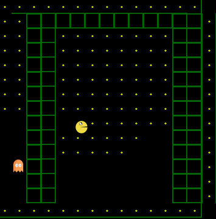
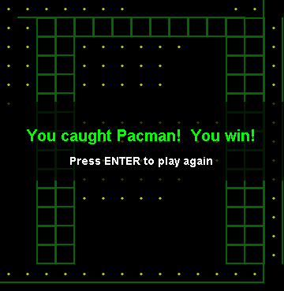

# Reverse Pac-Man

A modern, strategic twist on the classic arcade game. Instead of controlling Pac-Man, **you play as the ghost** ,hunt Pac-Man through the maze, anticipate his movements, and use special abilities to catch him before he collects all the pellets.

---

## Overview

| | |
|---|---|
| **Player Role** | Ghost |
| **AI Role** | Pac-Man |
| **Objective** | Catch Pac-Man before he eats all pellets |
| **Power Pellet** | Temporarily reverses roles — survive until it wears off |

---

## Core Mechanics

- **Grid-Based Movement** — Navigate the maze along defined paths
- **AI Pathfinding** — Pac-Man intelligently pursues remaining pellets
- **Power Pellet State Switching** — Dynamic reversal of hunter and hunted roles
- **Collision Detection** — Accurate, fair collision handling throughout the maze
- **Score & Round Tracking** — Track points and progress across rounds

---

## Ghost Abilities

Gain the strategic edge with four special abilities:

| Ability | Effect |
|---|---|
| **Phase Walk** | Move through walls briefly |
| **Teleport** | Warp instantly to another location in the maze |
| **Fear Pulse** | Temporarily slow Pac-Man |
| **Shadow Mode** | Become invisible to Pac-Man |

---

## Win Conditions

- **Ghost wins** — Catch Pac-Man
- **Pac-Man wins** — Collect all pellets

---

## Features

- AI-driven Pac-Man for dynamic, unpredictable gameplay
- Strategic ghost abilities to outsmart the AI
- Multiple rounds with increasing difficulty
- Score tracking for competitive play

---

## Installation & Setup

**Prerequisites:** Java 8 or higher

1. Clone or download the repository
2. Place the `Pacman_Pics` folder in the project root
3. Compile and run:

```bash
javac Main.java
java Main
```

---

## Screenshots

| Screenshot | Description |
|---|---|
|    | Ghost navigating the maze |
|   | Ghost chasing Pac-Man |
|  | Ghost catches Pac-Man — win screen |

> A demo clip (`Reverse_PacMan_demo.mp4`) can be added here to showcase real-time ghost strategy.

---

## Roadmap

- [ ] Multiplayer mode to control multiple ghosts
- [ ] New mazes and level designs
- [ ] Additional ghost abilities and power-ups
- [ ] Enhanced Pac-Man AI behaviour


